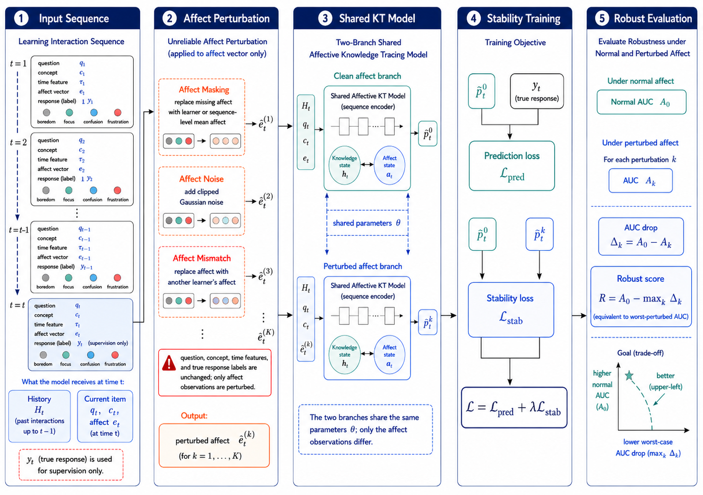
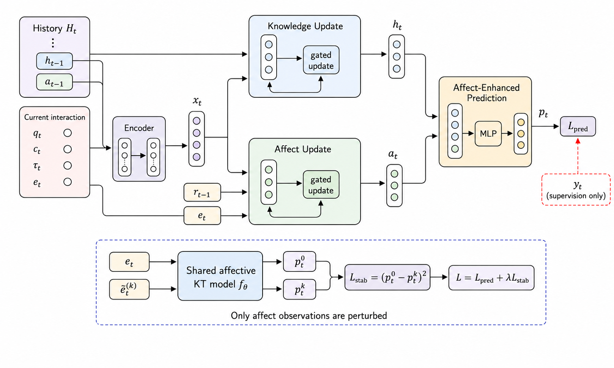
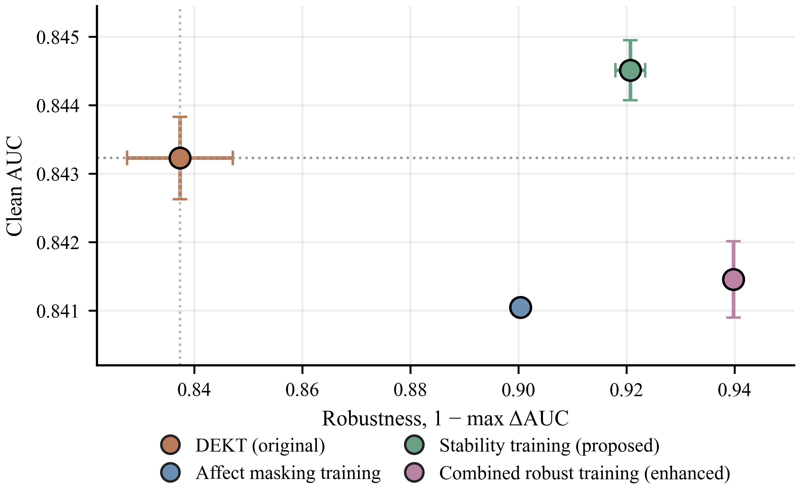
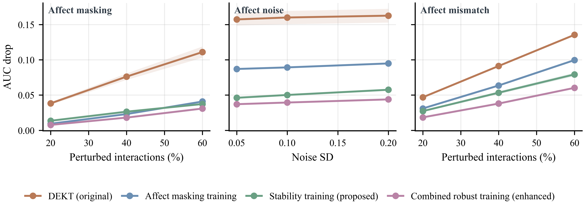

<div align="center">

# Stability-Oriented Affective Knowledge Tracing under Unreliable Affect Observations

**Official code and result artifacts for the paper**

[](#installation)
[](#installation)
[](LICENSE)
[](#citation)

</div>

## Overview

Emotional states can improve knowledge tracing, but affect observations in large-scale learning systems are rarely clean ground truth. They may be missing, noisy, or mismatched with the current learner. This repository studies a simple question:

> Can an affective knowledge tracing model remain predictive when its affect observations become unreliable?

We provide a stability-oriented evaluation and training framework for affective knowledge tracing. The core idea is to keep the educational interaction sequence unchanged while perturbing only the affect observations. A robust affective model should preserve normal prediction accuracy and reduce the performance drop under affect masking, affect noise, and affect mismatch.

<p align="center">
  
</p>

<p align="center"><em>Figure 1. Overall framework. Only affect observations are perturbed; exercises, concepts, temporal features, and responses remain unchanged.</em></p>

## Highlights

- **Problem setting.** We treat affect labels as uncertain observations rather than error-free psychological measurements.
- **Diagnostic metric.** We measure affect dependence by the worst nonnegative AUC drop under affect perturbation.
- **Training objective.** We add a stability loss that encourages similar predictions under clean and perturbed affect sequences.
- **Empirical finding.** Stability training substantially reduces affect-perturbation sensitivity while preserving clean prediction performance.
- **Boundary result.** A second dataset shows near-null affect dependence, suggesting that the existence of affect fields does not imply useful model dependence on affect.

## Method

Let \(e_t\) be an observed affect vector and \(\tilde e_t^{(k)}\) be its perturbed version under perturbation type \(k\). The same affective knowledge tracing model is evaluated under clean and perturbed affect:

```math
p_t^0 = f_\theta(\mathcal H_t, e_{\le t}),
\qquad
p_t^k = f_\theta(\mathcal H_t, \tilde e_{\le t}^{(k)}).
```

The stability-oriented objective is:

```math
\mathcal L =
\mathcal L_{\mathrm{pred}}
+ \lambda \mathcal L_{\mathrm{stab}},
\qquad
\mathcal L_{\mathrm{stab}}
=
\frac{1}{|\Omega|}
\sum_{(i,t)\in\Omega}
(p_{i,t}^0-p_{i,t}^k)^2 .
```

The robust score is:

```math
R=A_0-S,
\qquad
S=\max_k\max(0,A_0-A_k),
```

where \(A_0\) is clean AUC and \(A_k\) is AUC under the \(k\)-th affect perturbation.

<p align="center">
  
</p>

<p align="center"><em>Figure 2. Stability-oriented training. The clean and perturbed branches share parameters, and the stability loss penalizes prediction changes caused only by affect perturbation.</em></p>

## Main Results

On ASSISTments Challenge, the original affective knowledge tracing model is accurate under clean affect observations but highly sensitive to affect perturbations. Stability training reduces this sensitivity while preserving clean prediction.

| Model | Clean AUC | Maximum AUC drop | Robust score |
|---|---:|---:|---:|
| Original affective KT model | 0.843228 ± 0.000604 | 0.162636 ± 0.009772 | 0.680592 ± 0.010331 |
| Affect masking training | 0.841047 ± 0.000050 | 0.099598 ± 0.000906 | 0.741450 ± 0.000858 |
| **Stability training** | **0.844509 ± 0.000439** | **0.079296 ± 0.002754** | **0.765213 ± 0.003169** |
| Combined robust training | 0.841455 ± 0.000557 | 0.060253 ± 0.000787 | 0.781202 ± 0.001267 |

<p align="center">
  
</p>

<p align="center"><em>Figure 3. Clean prediction and robustness trade-off. Better models lie toward the upper-right region.</em></p>

<p align="center">
  
</p>

<p align="center"><em>Figure 4. AUC drop under affect masking, affect noise, and affect mismatch. Lower is better.</em></p>

## Repository Structure

```text
.
├── src/dekt/                         # Affective KT model, training, evaluation
├── tools/reliability_kt/             # Experiment runners and result aggregation
├── scripts/                          # Toy data and smoke test
├── results/
│   ├── figures/                      # Final paper figures
│   └── tables/                       # Paper-facing result tables
├── REPRODUCIBILITY.md                # Detailed protocol and hyperparameters
├── requirements.txt
└── README.md
```

## Installation

```bash
python -m venv .venv
source .venv/bin/activate
pip install -r requirements.txt
```

The main experiments require PyTorch. If you already have a working PyTorch environment, installing the remaining requirements is sufficient.

## Quick Start with Toy Data

The full ASSISTments datasets are not redistributed. To verify that the software path works without external data, run:

```bash
bash scripts/run_smoke_test.sh
```

This script creates a tiny synthetic dataset, trains for one epoch, evaluates clean affect and one perturbed-affect setting, and writes JSON metrics to `outputs/smoke/`.

## Data Format

Each dataset directory should contain:

```text
train0.txt
valid0.txt
test.txt
problem2skill
```

Each learner sequence is represented by 16 consecutive lines:

| Line | Content |
|---:|---|
| 1 | sequence length |
| 2 | concept sequence |
| 3 | response sequence |
| 4 | exercise sequence |
| 5 | interval-time feature sequence |
| 6 | answer-time feature sequence |
| 7 | boredom sequence |
| 8 | concentration sequence |
| 9 | confusion sequence |
| 10 | frustration sequence |
| 11 | question-difficulty feature sequence |
| 12 | skill-difficulty feature sequence |
| 13 | problem-type feature sequence |
| 14 | learner identifier sequence |
| 15 | prior-performance feature sequence |
| 16 | attempt-count feature sequence |

The `problem2skill` file is a Python literal dictionary mapping exercise identifiers to concept identifiers.

## Reproducing the Main Evidence

After preparing the processed datasets under `data/challenge` and `data/assist2012`, run:

```bash
python tools/reliability_kt/run_reliability_kt_plan.py \
  --output-root outputs/challenge_formal \
  --datasets challenge \
  --models dekt,dekt_generic_robust_selected,dekt_stability,dekt_combined_robust \
  --seeds 545194,545195,545196 \
  --epochs 30 \
  --lr 0.001 \
  --dropout 0.2 \
  --scheduler step \
  --stability-weight 0.2 \
  --stability-perturbation mixed \
  --stability-rate 0.4 \
  --stability-noise-std 0.1 \
  --train-perturbation mask \
  --train-perturbation-rate 0.3 \
  --include-perturbations \
  --python-bin python
```

Aggregate the metrics:

```bash
python tools/reliability_kt/aggregate_reliability_results.py \
  --manifest-csv outputs/challenge_formal/manifest.csv \
  --output-dir outputs/challenge_formal/tables

python tools/reliability_kt/summarize_publication_evidence.py \
  --metric-rows outputs/challenge_formal/tables/all_metric_rows.csv \
  --output-dir outputs/challenge_formal/paper_tables
```

See [`REPRODUCIBILITY.md`](REPRODUCIBILITY.md) for dataset statistics, hyperparameters, perturbation strengths, and seed settings.

## Paper Artifacts

Final paper figures are available in `results/figures/`.

| Figure | File |
|---|---|
| Overall framework | `figure01_overall_framework.png` |
| Model architecture | `figure02_model_architecture.png` |
| Clean prediction radar | `figure03_clean_prediction_radar.png` |
| Clean-robustness trade-off | `figure04_prediction_robustness_tradeoff.png` |
| Perturbation curves | `figure05_affect_perturbation_curves.png` |
| Robustness summary | `figure06_robustness_summary.png` |
| Dataset boundary | `figure07_dataset_boundary.png` |
| Paired evidence | `figure08_paired_evidence.png` |

Paper-facing result tables are available in `results/tables/`.

## Scope and Limitations

This repository is a paper-release package, not the full exploratory workspace. It does not include raw datasets, trained checkpoints, server logs, personal notes, failed intermediate experiments, or manuscript submission files.

The release is designed to support inspection, reuse, and reproduction of the paper evidence after users obtain the underlying datasets from their original sources.

## Citation

Citation information will be added after submission or acceptance. For now, please cite the repository URL if you use this code.

```bibtex
@misc{affective_kt_stability,
  title  = {Stability-Oriented Affective Knowledge Tracing under Unreliable Affect Observations},
  author = {Anonymous},
  year   = {2026},
  url    = {https://github.com/LeeShuaiyu/affective-kt-stability}
}
```

## License

This project is released under the MIT License.
